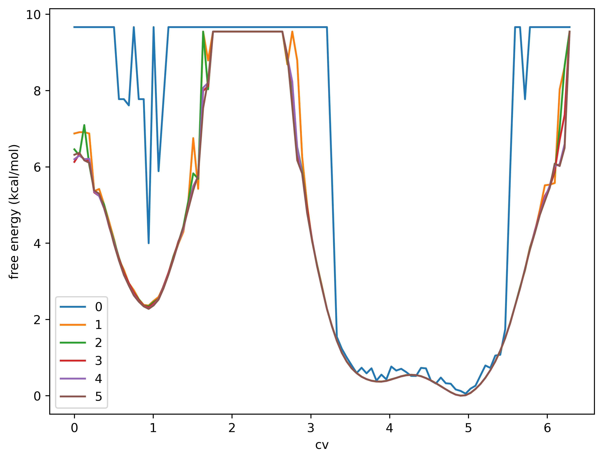
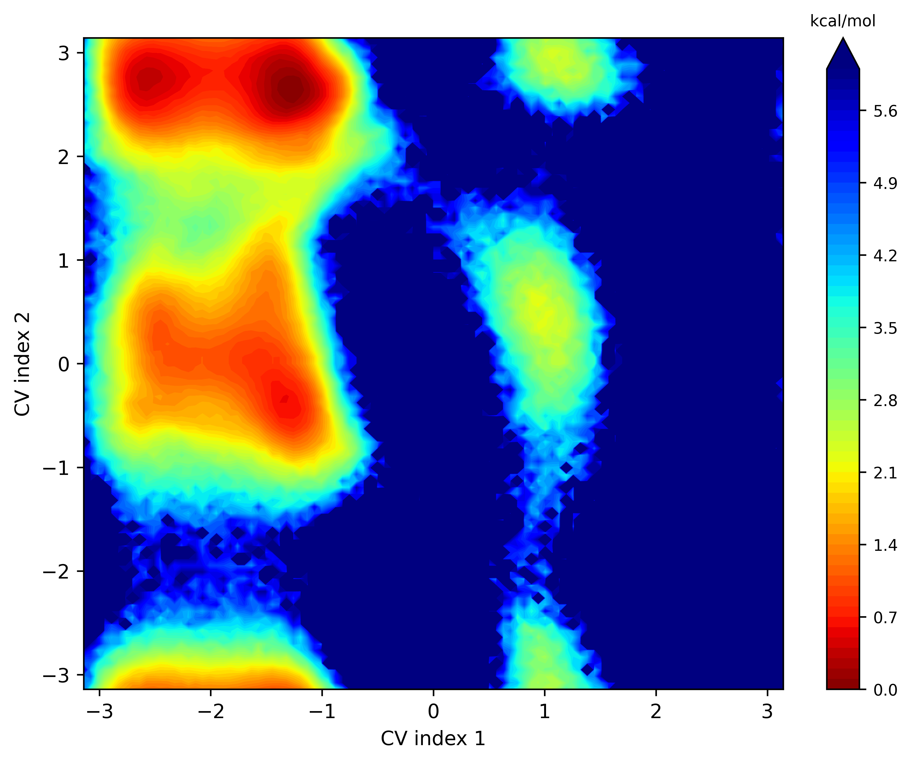
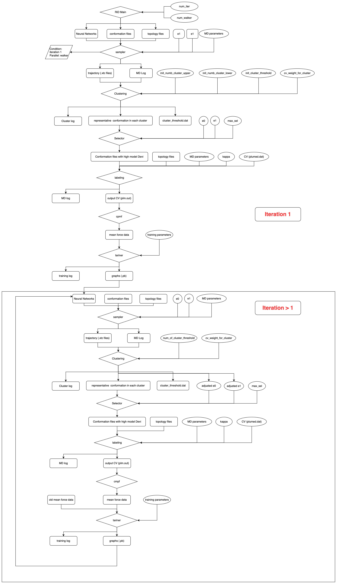

# Table of contents
- [About Rid-kit](#about-rid-kit)
- [Use Rid-kit with Bohrium k8s](#use-rid-kit-with-bohrium-k8s)
  - [Quick Start](#quick-start)
- [Use Rid-kit with Local k8s](#use-rid-kit-with-local-k8s)
- [Use Rid-kit without k8s environment](#use-rid-kit-without-k8s-environment)
- [Main procedure of RiD](#main-procedure-of-rid)
- [Preparing files in the input directory](#preparing-files-in-the-input-directory)
- [Configure simulations](#configure-simulations)
- [Configure machine resources](#configure-machine-resources)
- [Download files](#download-files-from-the-workflow)
- [Configure MCMC dimension reduction](#configure-mcmc)
- [Installation of environment on Slurm](#installation-of-environment-on-slurm)
- [Installation with DeepMD potential support](#installation-with-deepmd-potential-support)
- [Troubleshooting](#troubleshooting)

# About Rid-kit
Rid-kit is a package written in Python, designed to do enhanced sampling using reinforced dynamics. It aims to learn the free energy surface on the fly during MD run, and uses it as the bias potential during the next MD run. Its advantage is the ability to use a large number of CVs (100), thus can be used to simulate conformational changes of big molecules such as in the problem of protein folding.

Rid-kit is based on [dflow](https://github.com/deepmodeling/dflow), one can decide whether to use a k8s environment to run a workflow. It is recommended to use k8s environment to run the workflow unless it is not doable anyway. 

For more information, check the [documentation](https://rid-kit-dflow.readthedocs.io/en/latest/).

# Use Rid-kit with Bohrium k8s
## Quick start
The dflow team provide a community version of k8s [deepmodeling k8s](https://workflows.deepmodeling.com/), making the use of Rid-kit very convenient. To use the community version of k8s, one first need to register a Bohrium account in [Bohrium](https://bohrium.dp.tech/login) and learn a few concepts (job, jobgroup, project id) in the Bohrium website documents. Then the use of rid-kit is very easy.

### Set the environment variables
Just set the environment variables based on your personal Bohrium account information by

```
export DFLOW_HOST=https://workflows.deepmodeling.com
export DFLOW_K8S_API_SERVER=https://workflows.deepmodeling.com
export DFLOW_S3_REPO_KEY=oss-bohrium
export DFLOW_S3_STORAGE_CLIENT=dflow.plugins.bohrium.TiefblueClient
export BOHRIUM_USERNAME="<bohrium-email>"
export BOHRIUM_PASSWORD="<bohrium-password>"
export BOHRIUM_PROJECT_ID="<bohrium-project-id>"
```

### Install Rid-kit
Install the latest rid-kit

```bash
pip install setuptools_scm
pip install -U rid-kit
```

### Run an example
Change to the rid-kit directory

```bash
cd rid-kit
```

Run a example of Ala-dipeptide on Bohrium using dihedral as CVs (change to your own Bohrium account information)

```bash
rid submit -i ./tests/data/000 -c ./rid/template/rid_gmx_dih.json -m ./rid/template/machine_bohrium_k8s.json
```

You can also run the example on a Slurm machine (But you need to configure a conda environment on the slurm, see [Installation](docs/source/install.md))

```bash
rid submit -i ./tests/data/000 -c ./rid/template/rid_gmx_dih.json -m ./rid/template/machine_slurm_k8s.json
```

You can specify the workflow name by providing WORKFLOW_ID after "-d", for example:

```bash
rid submit -i ./tests/data/000 -c ./rid/template/rid_gmx_dih.json -m ./rid/template/machine_bohrium_k8s.json -d ala-dipeptide-1
```

**Note that the defined workflow-id should only contain lower case alphanumeric character, and specifal character "-".**

You can also specify other types of CVs such as distance or any customized CVs, for detailed explanation you can check 
- [configure simulations](docs/source/rid_configuration.md)

### Continue from an old workflow

Using `resubmit` to continue from an old workflow

```bash
# suppose the original workflow id is OLD_ID
rid resubmit -i ./tests/data/000 -c ./rid/template/rid_gmx_dis.json -m ./rid/template/machine_bohrium_k8s.json OLD_ID -d NEW_ID 
```

If you want to resubmit from a particular `iteration` and `step`:

```bash
rid resubmit -i your_dir -c path_to_rid.json -m path_to_machine.json OLD_ID -t ITERATION-ID -p STEP-KEY -d NEW_ID
```

 The `ITERATION-ID`(start from 1) is just `n`th iteration the workflow has been executed. The `STEP-KEY` in rid includes the following steps: `prep-exploration`, `run-exploration`, `prep-select`, `run-select`, `prep-label`, `run-label`, `label-stats`, `collect-data`, `merge-data`, `train`, `model-devi`.

### Download files from the workflow

```bash
rid download WORKFLOW_ID -p STEP-KEY -f FILE_NAME -a ITERATION_START -e ITERATION_END -o OUTPUT_DIR
```

typically we want the trajectories information from each exploration step, suppose we run a workflow for 20 iterations.

```bash
rid download WORKFLOW_ID -p run-exploration -f trajectory -a 1 -e 20 -o my_protein_out
```

Detained explanation for other files in the Rid run can be found as follows:
- [Download files](docs/source/rid_download.md)

### Reduce the dimension of free energy model
After the Rid-kit Run, the workflow will generate several numbers of free energy models (.pb). The Rid-kit currently support MCMC to reduce the dimension of the free energy model, for example:
```bash
rid redim -i ./test/data/models -c ./rid/template/rid_mcmc_cv_dih.json -m ./rid/template/machine_bohrium_k8s_mcmc.json
```
Then you will get the projected free energy surface for ala-dipeptide
 | 
---|---

You can also include .out file representing the CV output information inside the directory specified by `-i` parameter, this will plot the CV output upon the free energy surface.

# Use Rid-kit with Local k8s

A tutorial on using Rid-kit with k8s environment configured by your own can be found as follows:

- [Tutorial](docs/source/tutorial.md)

# Use Rid-kit without k8s environment
To run the workflow without k8s environment, one can use the `Debug` mode of `Dflow`. In this mode however, one can not monitor the workflow in the `Argo` UI.
## Run an example
If one wants to run the workflow on the `Slurm` machine locally, change to the rid-kit directory and type (change to your slurm configuration)

```bash
DFLOW_DEBUG=1 rid submit -i ./tests/data/000 -c ./rid/template/rid_gmx_dih.json -m ./rid/template/machine_slurm_local.json -d ala-dipeptide-1
```

# Main procedure of RiD

RiD will run in iterations. Every iteration contains tasks below:

1. Biased MD;
2. Restrained/Constrained MD;
3. Training neural network.

## Biased MD

Just like Metadynamics, RiD will sample based on a bias potential given by NN models. An uncertainty indicator will direct the process of adding bias potential.

## Restrained/Constrained MD

This procedure will calculate the mean force based on the sampling results of restrained MD or constrained MD, which can generate data set for training. 

## Neural network training

A fully connected NN will be trained via sampling data. This network will generate a map from selected CV to free energy.

A more detailed description of RiD is published now, please see:

> [1]  Zhang, L., Wang, H., E, W.. Reinforced dynamics for enhanced sampling in large atomic and molecular systems[J]. The Journal of chemical physics, 2018, 148(12): 124113.
>  
> [2]  Wang, D., Wang, Y., Chang, J., Zhang, L., & Wang, H. (2022). Efficient sampling of high-dimensional free energy landscapes using adaptive reinforced dynamics. Nature Computational Science, 2(1), 20-29.

# Preparing files in the input directory
Rules for preparing files in the input directory can be found in
- [Preparing files](docs/source/prepare_files.md)

# Configure simulations
- [configure simulations](docs/source/rid_configuration.md)

# Configure machine resources
- [configure machines](docs/source/rid_machine.md)

# Configure mcmc 
- [configure mcmc dimension reduction](docs/source/mcmc_configuration.md)

# Installation of environment on Slurm
If you sumit the RiD workflow to Bohrium, you do not need to install the enviroment yourself, rather Bohrium will pull the docker images to do the computation. But if you submit the workflow to Slurm machine, you will have to install the computation environment, details of the installation can be found in
- [Installation](docs/source/install.md)

# Installation with DeepMD potential support
Installation of the computation environment with DeepMD potential support on slurm machines can be found in
- [Installation of dp](docs/source/install_dp.md)

# Workflow Synopsis

- 

# Troubleshooting
- [Installation](docs/source/troubleshooting/installation.md)
- [Minikube](docs/source/troubleshooting/minikube.md)
- [Submit](docs/source/troubleshooting/submit.md)
